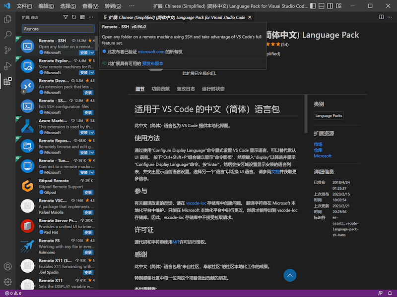
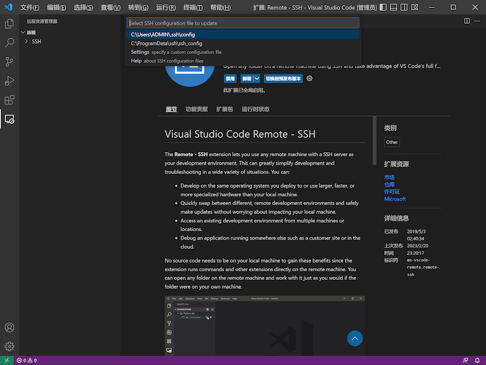
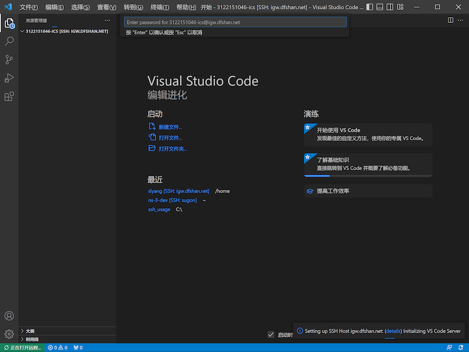

# VSCode Remote-SSH Setting

## VSCode安装
[VSCode官网](https://code.visualstudio.com/)

大家自行从官网找到适合自己本机系统与机器的Release进行下载安装，不做更多解释。

## VSCode Remote-SSH插件安装
打开VSCode，你会看到如下的界面

<figure markdown="span">
  { width=auto }
</figure>

点击左侧”积木“按键，进入扩展商店，

<figure markdown="span">
  { width=auto }
</figure>

扩展商店中搜索Remote，安装排名第一的扩展Remote-SSH。

<figure markdown="span">
  { width=auto }
</figure>

等待安装完成之后重新打开VSCode，你会看到一个小图标出现在侧边栏，这就是Remote-SSH

<figure markdown="span">
  { width=auto }
</figure>

配置服务器远程连接
安装好之后我们点击SSH上的”+“号，按下后会跳出一个框框提示我们输入ssh相关的命令，我们按照之前Linux服务器配置中的ssh命令填入，这里以3122151046-ics为例：

ssh 3122151046-ics@igw.dfshan.net -p2291
<figure markdown="span">
  { width=auto }
</figure>

按下Enter后，会让我们选择configuration File，这里的意思不需要细究，我们点击最上面的默认配置文件即可

<figure markdown="span">
  { width=auto }
</figure>

这样我们就保存成功了我们的服务器相关信息。此时一般会跳出一个配置文件的相关信息，我们核对无误之后就关掉VSCode并重新打开

<figure markdown="span">
  { width=auto }
</figure>

连接远端服务器
之前我们已经做好了相关的SSH配置，现在我们来尝试直接利用之前的配置来连接服务器。

重新开启VSCode，我们点开SSH发现出现了新的条目。点击对应用户名右侧文件夹按钮。

<figure markdown="span">
  { width=auto }
</figure>

此时VSCode会新开一个窗口这个窗口会提醒你在框框内键入密码，你在需要在这个框框内键入服务器密码，键入后就可以连接服务器。

（这里可能需要等待一会，因为需要在服务器端安装一些服务连接程序）

<figure markdown="span">
  { width=auto }
</figure>

连接完成之后点击侧边栏最上面的文件夹按钮，显示”已经连到远程“说明连接成功！

<figure markdown="span">
  { width=auto }
</figure>

点击打开文件夹按钮，选择对应你要打开的文件夹，可以直接点击确定，此时会从你的home用户目录下打开。

<figure markdown="span">
  { width=auto }
</figure>

打开后，点击信任作者，你可以在右边的资源管理器栏中选择文件进行修改编辑，并且你还可以把他当做FTP文件服务器使用，可以直接把本地的文件直接拖拽到侧边栏文件目录中，即可完成本地文件上传到服务器对应目录下的操作。

<figure markdown="span">
  { width=auto }
</figure>

至此你就可以开始快乐的编辑与Coding~！

!!! note
    VSCode还有很多强大的功能与插件，可玩性高，这里不再做过多的介绍，大家可以自行探索并寻求最高效的开发方式。